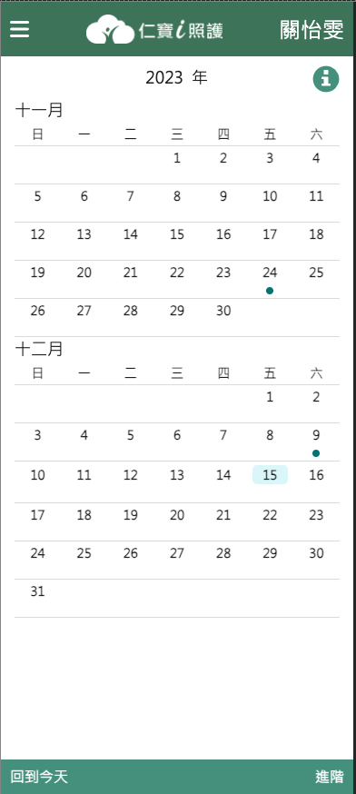
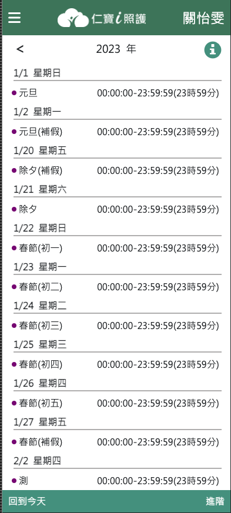

# Compal Calendar

Compal Calendar 使用於 React 應用的日曆與事件管理套件。提供了一個交互式日曆視圖，並支持自定義事件標記與顏色配置。該套件適用於需要日曆功能的各種應用，例如待辦事項管理、事件計劃或個人時間管理等。

## 功能

- 手機版本滑動月曆

   

- 日期選擇和日期信息

- 可定制的日期顏色標記

- 列表視圖與月曆視圖之間的切換

   

- 支持跳轉至今日日期功能

## 安裝

使用 npm 安裝 Compal Calendar：

```shell
 npm install @compal-swhq/compal-calendar
```

或使用 yarn：

```shell
yarn add @compal-swhq/compal-calendar
```

## 基本用法

在你的 React 應用中引入並使用 Compal Calendar與引入 css，

```tsx
import React from 'react';
import CompalCalendar from '@compal-swhq/compal-calendar';
import 'mobile-swipe-calendar/dist/style.css';

function MyComponent() {
 const [focusMonth, setFocusMonth] = useState(new Date()); // 畫面焦點的月份
  
  return(
     <CalendarProvider focusMonth={focusMonth} setFocusMonth={onFocusMonth}>
    		<CompalCalendar />
     </CalendarProvider>);
}
```

# 發布新版本到 GitHub Packages

1. 確保您的代碼更改已經合併到主分支。
2. 點擊「Create a new release」或「Draft a new release」。
3. 輸入版本標籤（如 v1.0.0），並選擇一個分支（通常是主分支）。
4. （可選）添加釋出說明來描述此版本的更改。
5. 點擊「Publish release」發布新版本。

一旦發布了新版本，GitHub Actions 工作流程會被觸發，自動在 Ubuntu 環境中構建並發布包到 GitHub Packages。
